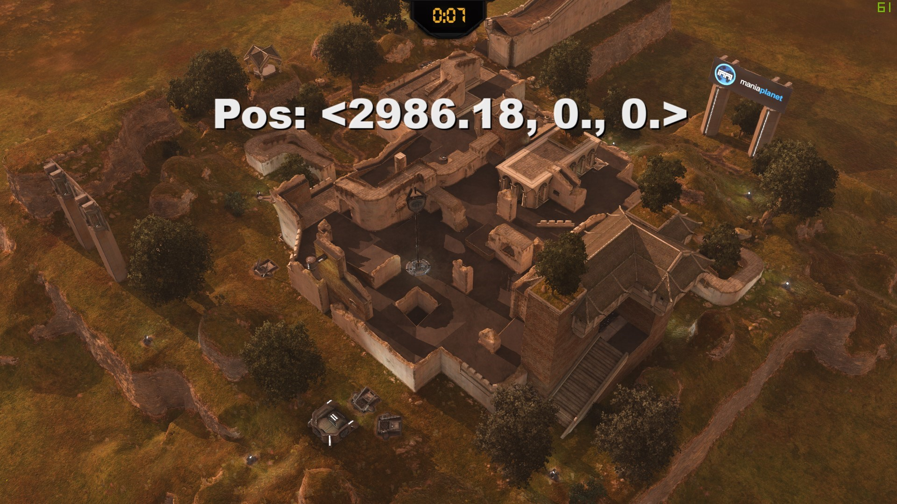

# Quick example

This example will make a fake player moving in a direction

*[To result folder](../Samples/ExampleGameMode)*

## 1. Create a folder structure

*You are free to choose your own structure, but this is just an example*
```yaml
- Scripts/Modes/ShootMania/
    - ExampleGameMode/
        - generated/
        - Systems/
            - CreatePlayerSystem.Script.txt
            - MoveWithDirectionSystem.Script.txt
        - Components/
            - Player.Script.txt
            - Position.Script.txt
            - MoveWithDirection.Script.txt
        - ExampleGameMode.Script.txt
        - query.txt
```

## 2. Create your components

*Important: Components should only have information about their primary role, if you create a component with player data and position data, you should seperate them into two components.*

- Player component (`Components/Player.Script.txt`)
```csharp
// I've put nothing in it (so it's tag component), but you can add some informations about what a player is (eg: login, id, ...)
#Struct SPlayer
{
}
```
- Position component (`Components/Position.Script.txt`)
```csharp
#Struct SPosition
{
    Vec3 Value;
}
```
- MoveWithDirection component (`Components/MoveWithDirection.Script.txt`)
```csharp
#Struct SMoveWithDirection
{
    Real Speed;
    Vec3 Direction;
}
```

## 3. Create your system

*Important: Systems should only modify components that are relative to them (don't access to a player component when you just need to move something)*
*Important: always place a `//nogenerate` tag at the start of the system or any script that don't hold components struct*

- CreatePlayer system (`Components/CreatePlayerSystem.Script.txt`)
```php
//nogenerate

#Include "Libs/ECS/EntityManager.Script.txt" as EntityManager
#Include "Modes/ShootMania/ExampleGameMode/generated/Components.Script.txt" as Components
#Include "Modes/ShootMania/ExampleGameMode/Components/Player.Script.txt" as PlayerComponent
#Include "Modes/ShootMania/ExampleGameMode/Components/Position.Script.txt" as PositionComponent
#Include "Modes/ShootMania/ExampleGameMode/Components/MoveWithDirection.Script.txt" as MoveWithDirectionComponent

#Struct PlayerComponent::SPlayer as SPlayer
#Struct PositionComponent::SPosition as SPosition
#Struct MoveWithDirectionComponent::SMoveWithDirection as SMoveWithDirection

Void Update()
{
    // Get all entities that have a player component
    declare Entities = Components::GetAllEntities(SPlayer {});
    if (Entities.count != 0) // if there is already one, we stop here
        return;

    // If there are no player entity, let's create one!
    declare PlayerEntity = EntityManager::CreateEntity();

    Components::Set(PlayerEntity, SPlayer {}); // add a player tag
    Components::Set(PlayerEntity, SPosition {Value = <0., 0., 0.>}); // add a position component
    Components::Set(PlayerEntity, SMoveWithDirection {Speed = 4.2, Direction = <1., 0., 0.>}); // add a move component (you can tweak the values)
}
```

- MoveWithDirection system (`Components/MoveWithDirectionSystem.Script.txt`)
```php
//nogenerate

#Include "Modes/ShootMania/ExampleGameMode/generated/Components.Script.txt" as Components
#Include "Modes/ShootMania/ExampleGameMode/Components/Position.Script.txt" as PositionComponent
#Include "Modes/ShootMania/ExampleGameMode/Components/MoveWithDirection.Script.txt" as MoveWithDirectionComponent

#Struct PositionComponent::SPosition as SPosition
#Struct MoveWithDirectionComponent::SMoveWithDirection as SMoveWithDirection

Void Update()
{
    // Get all entities with Position and MoveWithDirection components
    foreach (Entity in Components::GetAllEntities(SPosition {}, SMoveWithDirection {}))
    {
        declare Position = Components::Get(Entity, SPosition {}); // get the position component value
        declare MoveWithDirection = Components::Get(Entity, SMoveWithDirection {}); // get the move component value

        Position.Value += MoveWithDirection.Direction * MoveWithDirection.Speed; // update the position...

        UIManager.UIAll.BigMessage = "Pos: " ^ Position.Value; // debug: let's display the position of the player

        Components::Set(Entity, Position); // Replace the position component...
    }
}
```

## 4. Create the query file content

To make our queries work (`Components::GetAllEntities(...)`), we need to fill some information into `query.txt`:

```csharp
// CreatePlayerSystem queries
SPlayer

// MoveWithDirectionSystem queries
SPosition, SMoveWithDirection
```

## 5. Fill the main gamemode file.

The systems will not be called automatically, so we need to make a basic gamemode file (`ExampleGameMode.Script.txt`):

```php
#Extends "Modes/ShootMania/Base/ModeShootmania.Script.txt"

#Include "Modes/ShootMania/ExampleGameMode/Systems/CreatePlayerSystem.Script.txt" as CreatePlayerSystem
#Include "Modes/ShootMania/ExampleGameMode/Systems/MoveWithDirectionSystem.Script.txt" as MoveWithDirectionSystem

***Match_PlayLoop***
***
    CreatePlayerSystem::Update();
    MoveWithDirectionSystem::Update();
***	

Void N() {}
```

We are almost here! We just need to generate the components file!

## 6. Generation of component file

Let's create a `.bat` file, name it whatever you want:
```bat
dotnet ManiaECS-Generator.dll -p "Modes/ShootMania/ExampleGameMode/" -i "(MP Location)\Scripts\Modes\ShootMania\ExampleGamemode" -o "(MP Location)\Scripts\Modes\ShootMania\ExampleGamemode\generated"
```
Some informations about the parameters:
- `-p` is folder prefix.
- `-i` is the input folder.
- `-o` is the output folder.

Once it's done, place it along with ManiaECS-Generator.dll and start the .bat
You should see something like that: 

**Now you can start your gamemode to see if it work!**

